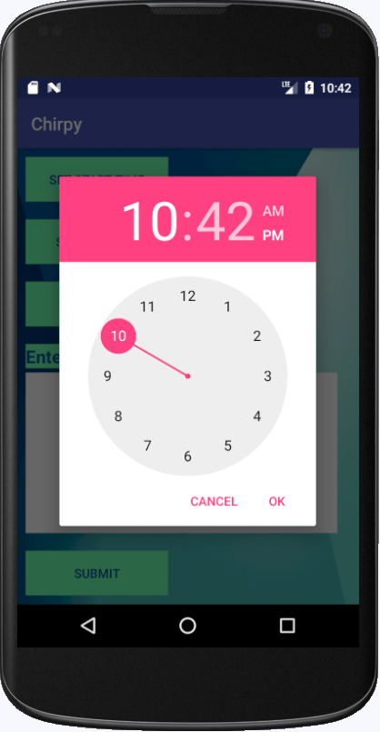

# Chirpy
 Chirpy is an autonomous SMS sending app. It can detect and analyze missed calls If the user fails to receive a phone call , Chirpy will automatically send an SMS to the caller informing him/her about the user . Each caller will receive only one SMS even if they call multiple times. The user will be able to specify the time during which Chirpy will stay active. The user will also be able to store specific messages for specific users, or a general message for everyone who calls during the set up time. Chirpy will not send any SMS for received calls. The user will be able to delete any alert profile anytime.

:pushpin:**First allow necessary permissions for the app to run properly**

:pushpin:**Main menu**

:pushpin:**Tap on "Set Alert" button to create new alert entry. Select start time,end time,contact number and message.**

:pushpin:**If no contact has been selected then the entry will be active for all incoming missed calls.**

:pushpin:**If end time is less than start time the app will show error.**

:pushpin:**All the entries can be viewd and deleted by tapping "View Entries" button from main menu.**

:pushpin:**After detecting missed calls the app will send respective messages through SMS.After sending the SMS,related entry will be automatically deleted.**

:pushpin:**The "About App" button shows the developer names and explains how to use the app.**

:pushpin:**The overall structure of the code has been given below :**

:heavy_exclamation_mark: **The app don't include any android service implementation. So it needs to be at least kept minimized for it to function properly. Closing the app resets all the entries.**
